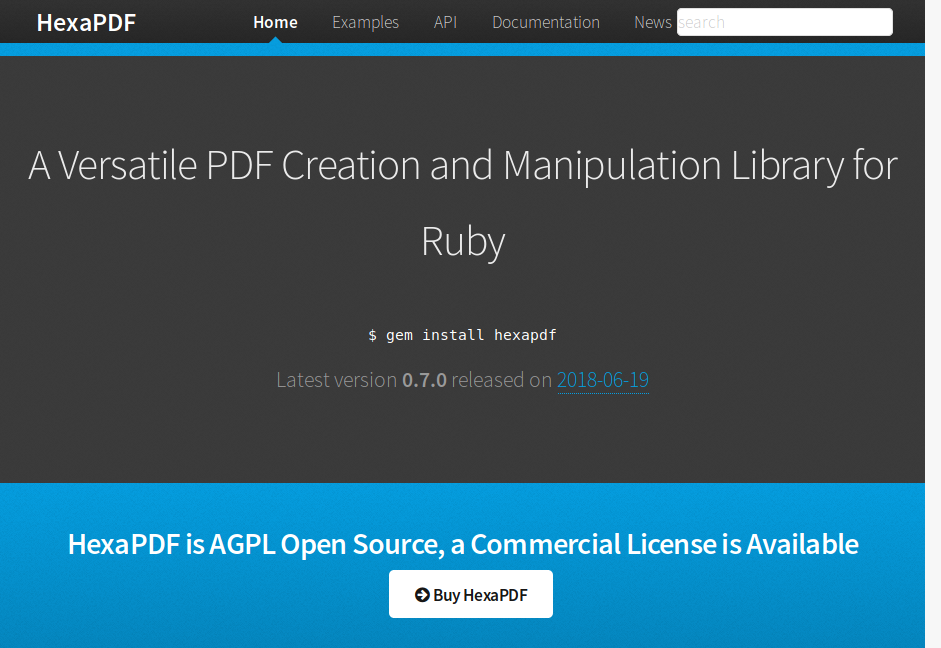
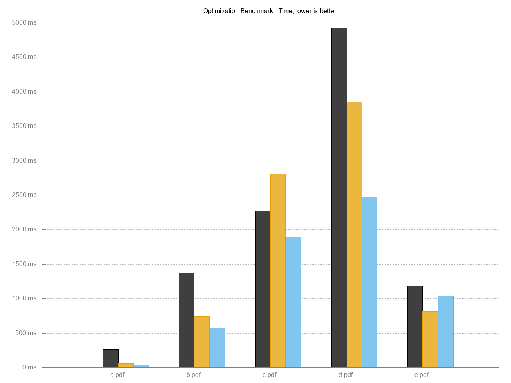
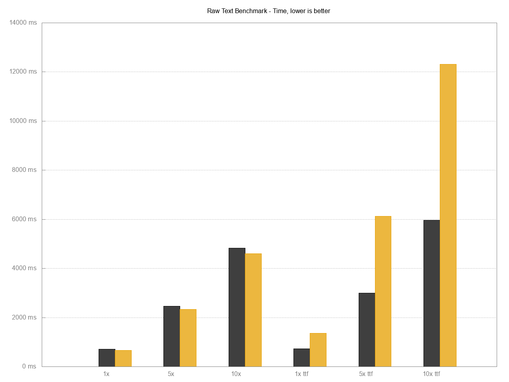
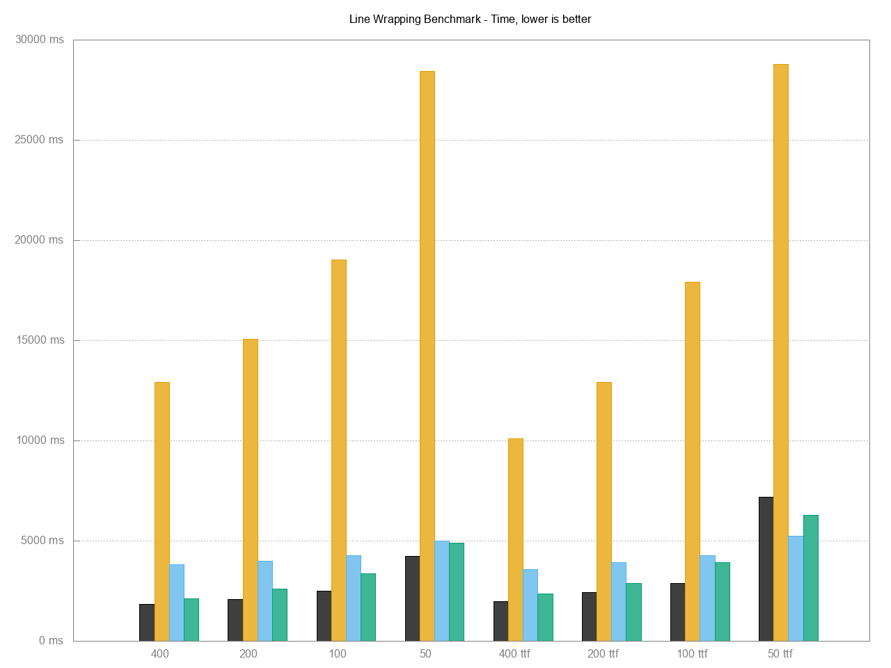
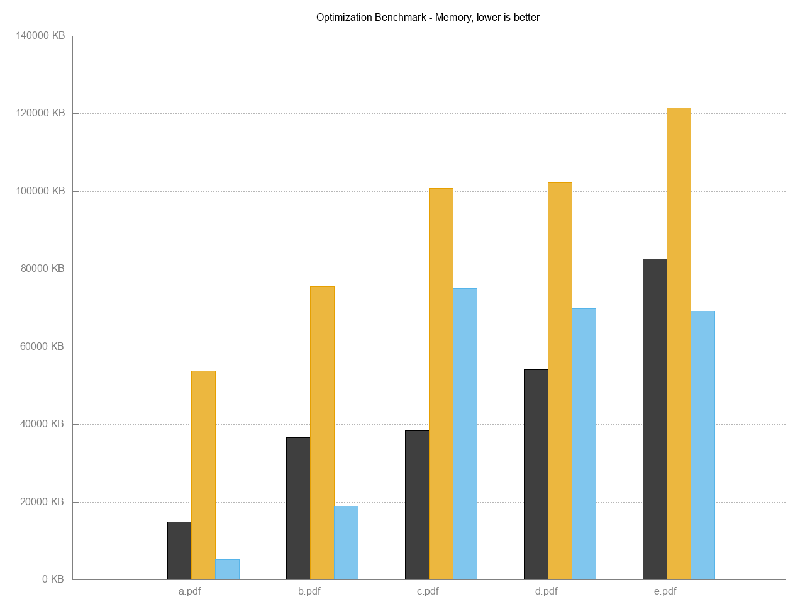

title: HexaPDF
subtitle: and Other PDF Solutions
author: Thomas Leitner a.k.a. gettalong
theme: league

## There exist some PDF libraries for Ruby

## PDF generation

Prawn

## PDF reading

pdf-reader

## PDF inspection

pdf-inspector

## PDF merging

combine_pdf

## PDF framework

origami\\
(originally intended for auditing PDFs)

## What have all these projects in common?

* Prawn

* pdf-reader

* pdf-inspector

* combine_pdf

* origami

{:.fragment.hp}
They only implement a subset of PDF functionality.

## There was no purpose-designed PDF solution

{:.fragment}
until

# HexaPDF

{: style="height: 450px"}

## HexaPDF is ...

* a versatile PDF creation and manipulation library for Ruby

* a standalone application for performing the most common PDF tasks like merging files

* designed with ease of use and performance in mind

# Design

## Ruby-esque API interface

~~~ ruby
require 'hexapdf'

doc = HexaPDF::Document.new
canvas = doc.pages.add.canvas
canvas.font('Helvetica', size: 100)
canvas.text("Hello World!", at: [20, 400])
doc.write("hello-world.pdf")
~~~

## PDF objects are represented by native Ruby objects

~~~
require 'hexapdf'

doc = HexaPDF::Document.new
info = doc.trailer.info
info[:Title] = 'This is the PDF document title'
info[:CreationDate] = Time.now
doc.catalog[:PageLayout] = :SinglePage
doc.catalog[:NeedsRendering] = true
~~~

## Automatic conversion of "special" data types like dates and binary strings

~~~
require 'hexapdf'
require 'stringio'

doc = HexaPDF::Document.new
doc.trailer.info[:CreationDate] = Time.now
doc.trailer.info[:UnknownField] = Time.now
out = StringIO.new
doc.write(out)

doc = HexaPDF::Document.new(io: out)
info = doc.trailer.info
p info.data.value[:CreationDate]  # => "D:20180826074144+02'00'"
p info[:CreationDate]             # => 2018-08-26 07:41:44 +0200
p info.data.value[:CreationDate]  # => 2018-08-26 07:41:44 +0200
p info[:UnknownField]             # => "D:20180826074144+02'00'"
~~~

See [`lib/hexapdf/dictionary_fields.rb`](https://github.com/gettalong/hexapdf/blob/master/lib/hexapdf/dictionary_fields.rb)
and [`HexaPDF::Dictionary#[]`](https://github.com/gettalong/hexapdf/blob/master/lib/hexapdf/dictionary.rb#L148)

## Automatic conversion of PDF types

~~~
class HexaPDF::Type::Info < Dictionary

  define_type :XXInfo
  define_field :Title,        type: String, version: '1.1'
  define_field :Author,       type: String
  define_field :Subject,      type: String, version: '1.1'
  define_field :Keywords,     type: String, version: '1.1'
  define_field :Creator,      type: String
  define_field :Producer,     type: String
  define_field :CreationDate, type: PDFDate
  define_field :ModDate,      type: PDFDate
  define_field :Trapped,      type: Symbol, version: '1.3'

end

HexaPDF::GlobalConfiguration['object.type_map'][:XXInfo] =
 'HexaPDF::Type::Info'
~~~

## Low-level API with convenience API on top

~~~
class HexaPDF::Type::PageTreeNode < Dictionary

  define_type :Pages
  define_field :Type,   type: Symbol, required: true, default: type
  define_field :Parent, type: Dictionary, indirect: true
  define_field :Kids,   type: Array, required: true, default: []
  define_field :Count,  type: Integer, required: true, default: 0

  def page_count
  def page(index)
  def insert_page(index, page)
  def add_page(page)
  def delete_page(page)
  def each_page

end
~~~

## Validation of PDF objects

{: style="font-size: 0.45em"}
~~~
class HexaPDF::Type::Trailer
  def perform_validation
    super
    unless value[:ID]
      msg = if value[:Encrypt]
              "ID field is required when an Encrypt dictionary is present"
            else
              "ID field should always be set"
            end
      yield(msg, true)
      set_random_id
    end

    unless value[:Root]
      yield("A PDF document must have a Catalog dictionary", true)
      value[:Root] = document.add(Type: :Catalog)
      value[:Root].validate {|message, correctable| yield(message, correctable) }
    end

    if value[:Encrypt] && (!document.security_handler ||
                           !document.security_handler.encryption_key_valid?)
      yield("Encryption key doesn't match encryption dictionary", false)
    end
  end
end
~~~

## Orthogonal design of classes

~~~
require 'hexapdf'

s = HexaPDF::Serializer.new
p s.serialize(Time.now)        # => "(D:20180826080743+02'00')"

source = HexaPDF::Filter.source_from_string('My String')
source = HexaPDF::Filter::ASCII85Decode.encoder(source)
p HexaPDF::Filter.string_from_source(source) # => "9mIj[FE2)5B)~>"
~~~

## Fully tested

<pre>
$ rake test
Run options: --seed 5344

# Running:

.......|SNIP 100s more dots|..............................

Finished in 2.093626s, 885.5449 runs/s, 13857.2973 assertions/s.

1854 runs, 29012 assertions, 0 failures, 0 errors, 0 skips
Coverage report generated. 9032 / 9032 LOC (100%) covered.
</pre>

# Performance

## Optimized parsing and serializing

HexaPDF vs ? - file size optimization

{: style="height: 400px"}

{:.fragment}
Black HexaPDF, orange pdftk (GCJ), blue QPDF (C++)

## Optimized text output

HexaPDF vs ? - raw text output

{: style="height: 400px"}

{:.fragment}
Black HexaPDF, orange Prawn

## Avoiding work

HexaPDF vs ? - line wrapping

{: style="height: 400px"}

{:.fragment}
Black HexaPDF, orange Prawn, blue reportlab, green tcpdf

## Low memory usage

* Optimized code to avoid unnecessary allocations
* Lazy loading - only load from PDF what is needed

{: style="height: 350px"}

Black HexaPDF, orange pdftk (GCJ), blue QPDF (C++)

## Small output files

* Generate readable (because most of PDF is in ASCII format) but compact output

* Use best compression available

* `hexapdf optimize` produces smaller files than pdftk and qpdf

# Demo time

`hexapdf` application

* `cmdparse` library for command-style interface

* Merging PDF files (comparison with `pdftk`)

* Modifying a PDF file (selecting and optionally rotating pages)

* Batch execution

# Demo time

Code samples and comparisons

* Raw text benchmark

* Line wrapping benchmark

* Image centering and stitching scripts

* Complex text fitting

## Future work

* Text layout using classes like `Paragraph`, `Table`, ...

* AcroForm support

* Document outlines (i.e. bookmarks)

* More commands for the CLI

* ...

## Summary and further information

* {:.fragment .hp} HexaPDF is a complete PDF solution, written in pure Ruby

* {:.fragment} `hexapdf` binary for most quick PDF tasks like merging

* {:.fragment} Homepage and documentation at <https://hexapdf.gettalong.org>

* {:.fragment} Licensed under the AGPL, commercial licenses available at <https://gettalong.at/hexapdf>

# Thank You!

What questions do you have?

