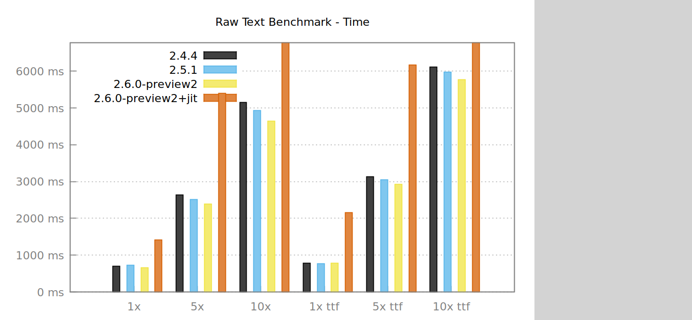
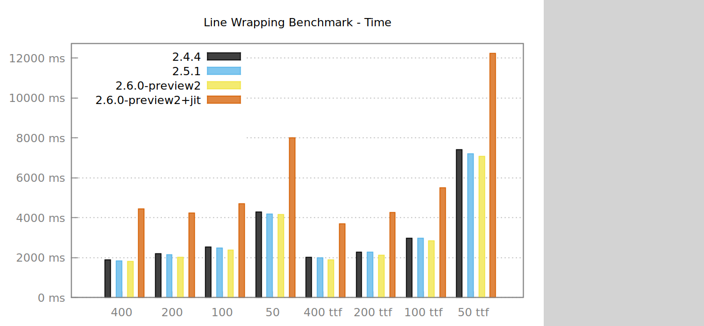

title: Ruby 2.5/2.6
subtitle: New Features and Performance Improvements
author: Thomas Leitner
theme: black

# Ruby 2.5

## Ruby 2.5 New Features

  - rescue/else/ensure are now allowed to be used directly with do/end blocks. [Feature #12906]
  - Print backtrace and error message in reverse order (oldest call first, most recent call last) [Feature #8661] 
  - Support branch coverage and method coverage measurement. [Feature #13901]
  - Top-level constant look-up is no longer available. [Feature #11547]

## Ruby 2.5 New Features (cont.)
  - One of our most loved libraries, pp.rb, is now automatically loaded. You no longer have to write require "pp". [Feature #14123]
  - Promote cmath, csv, date, dbm, etc, fcntl, fiddle, fileutils, gdbm, ipaddr, scanf, sdbm, stringio, strscan, webrick, zlib from standard libraries to default gems.
  - Onigmo 6.1.3 absence operator `(?~exp)` (also in 2.4.1)

## Ruby 2.5 New Features (cont.)
  - Better RDoc by using Ripper instead of IRB based parser
  - IO#write now receives multiple arguments. [Feature #9323]
  - Hash#transform_keys [Feature #13583]
  - `-"literal"` (`String#-@`) optimized to return the same object (same as `"literal".freeze` in Ruby 2.1+) [Feature #13295]
  - `binding.irb` automatically requires irb and runs [Bug #13099]

## Ruby 2.5 Performance Improvements
  - 5-10% due to removal of `trace` instructions (dynamic instrumentation is used instead) [Feature #14104]
  - Block passing by a block parameter (e.g. `def foo(&b); bar(&b); end`) is about 3 times faster than Ruby 2.4 by “Lazy Proc allocation” technique. [Feature #14045]

## Ruby 2.5 Performance Improvements (cont.)
  - Improve performance of some built-in methods including `Array#concat`, `Enumerable#sort_by`, `String#concat`, `String#index`, `Time#+`, and more.
  - `IO.copy_stream` uses copy_file_range(2) to provide copy offloading. [Feature #13867]

## Ruby 2.5 Further Reading

  - <https://www.ruby-lang.org/en/news/2017/12/25/ruby-2-5-0-released/>
  - <https://github.com/ruby/ruby/blob/v2_5_0/NEWS>
  - <https://medium.com/rubyinside/the-new-absent-operator-in-ruby-s-regular-expressions-7c3ef6cd0b99>
  - <https://gettalong.org/blog/2017/benchmarking-ruby-2-5.html>

  Note: The items for the slides "New Features" and "Performance Improvements" were mostly taken verbatim from the first two links.

# Ruby 2.6

## Ruby 2.6 New Features

  - Add Binding#source_location. [Feature #14230]
  - Constant names may start with a non-ASCII capital letter. [Feature #13770]
  - Endless range syntax (1..), same as (1..nil) [Feature #12912]
  - Range#=== now uses #cover? instead of #include? method (#cover? is faster because it only checks the bounds) [Feature #14575]

## Ruby 2.6 Performance Improvements

  - Introduction of JIT [Feature #14235]
  - Speedup Proc#call because we don’t need to care about $SAFE any more. [Feature #14318]
  - Speedup block.call where block is passed block parameter. [Feature #14330]

## Ruby 2.6 JIT (YARV-MJIT)

  - By Takashi Kokubun (and Vladimir Makarov)
  - Use `--jit` to activate it (there are some other options)
  - Compiles C code via gcc/clang
  - Significant enhancements between preview1 and preview2
  - Follow changes on Github <https://github.com/ruby/ruby/commits?author=k0kubun>
  - Enhancements measured using optcarrot benchmark which is also used for Ruby 3x3 measurement

## Ruby 2.6 Further Reading

  - <https://www.ruby-lang.org/en/news/2018/05/31/ruby-2-6-0-preview2-released/>
  - <https://github.com/ruby/ruby/blob/v2_6_0_preview2/NEWS>
  - <https://developers.redhat.com/blog/2018/03/22/ruby-3x3-performance-goal/>
  - <https://blog.heroku.com/ruby-mjit>
  - <https://medium.com/@k0kubun/benchmark-driver-designed-for-ruby-3x3-6a5eeb1d1494>
  - <https://speakerdeck.com/k0kubun/method-jit-compiler-for-mri>
  - <https://github.com/benchmark-driver/benchmark-driver>

# Ruby AST Differences

Demo time

~~~
ruby -ve "puts RubyVM::InstructionSequence.
          compile('x, y = 1, 2; [x, y].max').disasm"
~~~

# Benchmarking

## Available Tools

  - Built-in library `benchmark`
  - Better: gem `benchmark-ips`
  - Newest: gem `benchmark-driver`

## benchmark

  - Very simple
  - Usage:

    ~~~
    Benchmark.bm do |x|
      x.report("name1") { code1 }
      x.report("name2") { code2 }
    end
    ~~~

  - Better use `Benchmark.bmbm` since it warms up the runtime
  - You need to determine the loop count yourself

## benchmark-ips

  - Usage like with `benchmark`:

    ~~~
    Benchmark.ips do |x|
      x.report("name1") { code1 }
      x.report("name2", "code-as-string")
      x.compare!
    end
    ~~~

  - Warm-up done by default
  - Determines loop count automatically
  - Helper method for easy comparions
  - Allows to pass code as string to avoid block-calling avoid

## benchmark-driver

  - Made by Takashi Kokubun to easily test different versions of Ruby and micro-benchmarks
  - Usage similar:

    ~~~
    Benchmark.driver do |x|
      x.prelude "set-up code here"
      x.report("name1", "code-as-string")
      x.report("name2", "code-as-string")
    end
    ~~~

  - In addition to warm-up and loop count determination, **it subtracts the loop overhead** itself which is important for micro-benchmarks
  - Allows testing multiple Ruby version using rbenv
  - Drive benchmarks using simple YAML files

## Benchmark Demo Time

`a < b ? b : a`

vs

`[a, b].max`

## HexaPDF Benchmarks

- Same code run on different Ruby versions
- Alas, Ruby 2.6 in JIT-mode is slower

## Raw Text Benchmark

## Line Wrapping Benchmark

## Optcarrot

*The* official benchmark for verifying the Ruby 3x3 goal!

~~~
git clone git@github.com:mame/optcarrot.git
cd optcarrot
# switch to Ruby 2.6-preview2
ruby -Ilib bin/optcarrot --benchmark examples/Lan_Master.nes
ruby --jit -Ilib bin/optcarrot --benchmark examples/Lan_Master.nes
# switch to TruffleRuby :)
ruby -Ilib -r./tools/shim bin/optcarrot --benchmark examples/Lan_Master.nes
~~~

# Thank You

You can find the files used during the presentation in the [files](files/) directory.

[Feature #12906]: https://bugs.ruby-lang.org/issues/12906
[Feature #8661]: https://bugs.ruby-lang.org/issues/8661
[Feature #13901]: https://bugs.ruby-lang.org/issues/13901
[Feature #11547]: https://bugs.ruby-lang.org/issues/11547
[Feature #14123]: https://bugs.ruby-lang.org/issues/14123
[Feature #9323]: https://bugs.ruby-lang.org/issues/9323
[Feature #13583]: https://bugs.ruby-lang.org/issues/13583
[Feature #13295]: https://bugs.ruby-lang.org/issues/13295
[Bug #13099]: https://bugs.ruby-lang.org/issues/13099
[Feature #14104]: https://bugs.ruby-lang.org/issues/14104
[Feature #14045]: https://bugs.ruby-lang.org/issues/14045
[Feature #13867]: https://bugs.ruby-lang.org/issues/13867

[Feature #14230]: https://bugs.ruby-lang.org/issues/14230
[Feature #13770]: https://bugs.ruby-lang.org/issues/13770
[Feature #12912]: https://bugs.ruby-lang.org/issues/12912
[Feature #14575]: https://bugs.ruby-lang.org/issues/14575
[Feature #14235]: https://bugs.ruby-lang.org/issues/14235
[Feature #14235]: https://bugs.ruby-lang.org/issues/14235
[Feature #14318]: https://bugs.ruby-lang.org/issues/14318
[Feature #14330]: https://bugs.ruby-lang.org/issues/14330

[rbenv]: https://github.com/rbenv/rbenv

