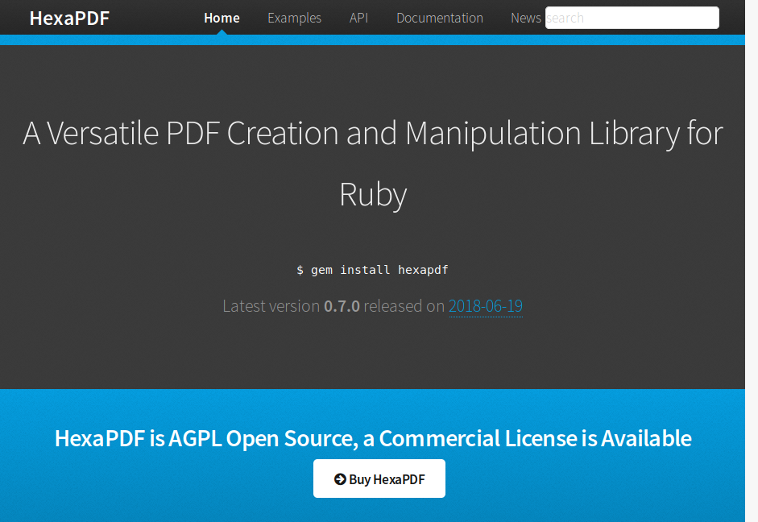
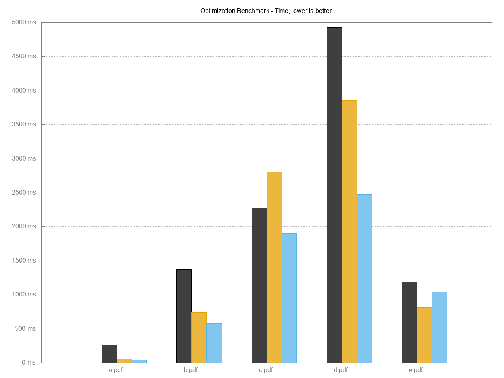
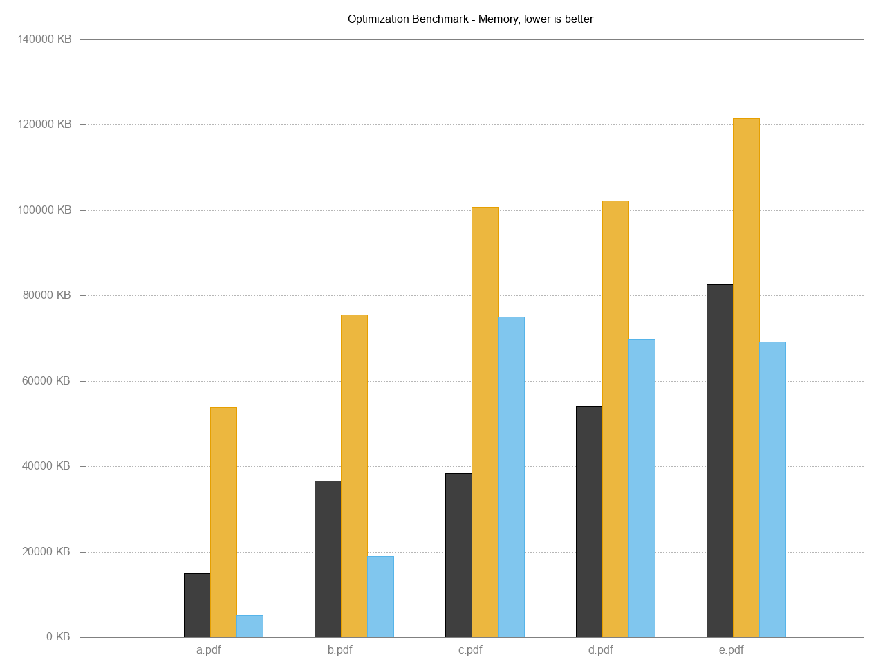
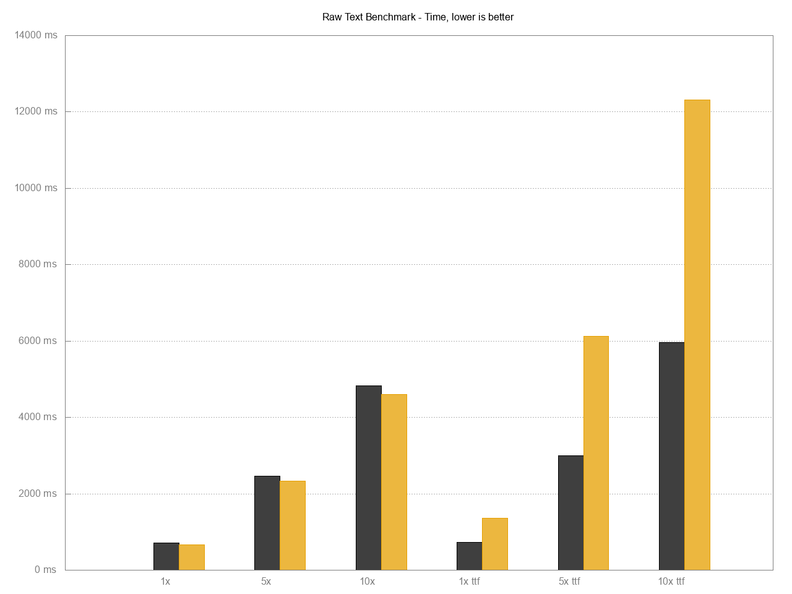
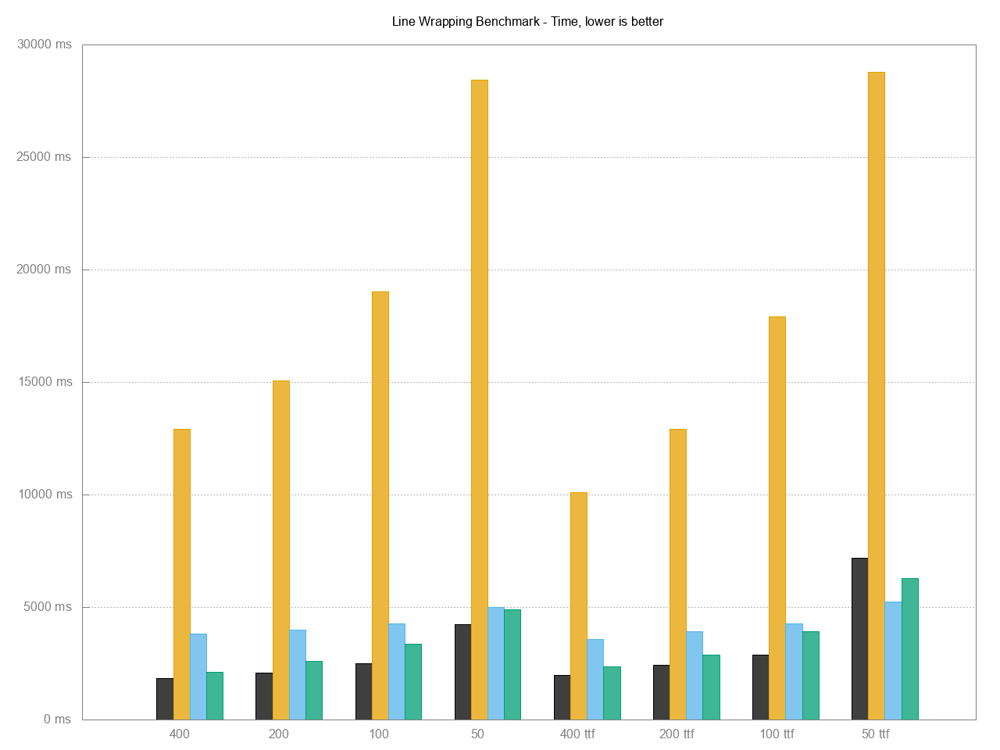

title: Designing HexaPDF
subtitle: Iterative Design, Orthogonality and Other Designs
author: Thomas Leitner a.k.a. gettalong
theme: league

# What is HexaPDF?

{: style="height: 450px"}

## HexaPDF is ...

* a versatile PDF creation and manipulation library for Ruby

* a standalone application for performing the most common PDF tasks like merging files

* designed with ease of use and performance in mind

## Where does one start when implementing a 756 page specification?

## Read the whole spec once,  find the instant gratification parts

## Then build iteratively on that base

## In case of PDF: Parsing and serializing

## Parsing and serializing

* Relatively easy to do for PDF since the format is ASCII-based
* Only about 40 pages (I *didn't* count the pages of the referenced specs... :-)
* A PDF mostly consists of objects with a certain data type and some other stuff
* Pain point: "Invalid" PDFs
* Instant gratification: *We can read and write PDFs!*

## Handling of "invalid" PDFs

* Configuration option for how to handle parse errors
* Try to work around common problems by default
* Strictly valid output according to PDF specification (and sometimes the Adobe
  version if things are unclear)

## Now that we can parse a PDF -  how do we represent the PDF objects in Ruby?

## Native PDF data types

* Booleans
* Integers, Floats
* Strings (in various forms)
* Names
* Arrays
* Dictionaries
* Streams
* Null
* Indirect Objects

## Those types look very familiar...

## PDF objects are mostly represented by native Ruby objects

~~~
require 'hexapdf'

doc = HexaPDF::Document.new
info = doc.trailer.info
info[:Title] = 'This is the PDF document title'
info[:CreationDate] = Time.now
doc.catalog[:PageLayout] = :SinglePage
doc.catalog[:NeedsRendering] = true
~~~

* Indirect objects are implemented via `HexaPDF::Object` which wraps all the
  information (oid, gen, value, stream) in a separate `HexaPDF::PDFData`
  object.

## Benefits of using native Ruby objects

* Low memory usage
* Optimized implementation in C
* Easy to work with, no need to learn a new object API
* `HexaPDF::PDFData` increases memory usage but provides "convertibility"

## Alas, some data types are "special"

* Dates
* Binary strings
* Rectangles

They rely on a base type but use special semantics.

→ Use automatic, behind-the scenes conversion

## Automatic conversion of "special" data types

~~~
require 'hexapdf'
require 'stringio'

doc = HexaPDF::Document.new
doc.trailer.info[:CreationDate] = Time.now
doc.trailer.info[:UnknownField] = Time.now
out = StringIO.new
doc.write(out)

doc = HexaPDF::Document.new(io: out)
info = doc.trailer.info
p info.data.value[:CreationDate]  # => "D:20180826074144+02'00'"
p info[:CreationDate]             # => 2018-08-26 07:41:44 +0200
p info.data.value[:CreationDate]  # => 2018-08-26 07:41:44 +0200
p info[:UnknownField]             # => "D:20180826074144+02'00'"
~~~

See [`lib/hexapdf/dictionary_fields.rb`](https://github.com/gettalong/hexapdf/blob/master/lib/hexapdf/dictionary_fields.rb)
and [`HexaPDF::Dictionary#[]`](https://github.com/gettalong/hexapdf/blob/master/lib/hexapdf/dictionary.rb#L148)

## How does this automatic conversion work?

## PDF dictionary types

* The Dictionary is the basic building block of PDF.
* Many dictionary objects have a `:Type` key specifying their type but
  sometimes the type is only implicitly known through their location.
* Such types are specified in the PDF spec, haven't counted but I guess there
  are more than 100.
* We can re-wrap the contained `HexaPDF::PDFData` object in a "throwaway"
  object based on the type that provides additional functionality
* By defining the known fields for a PDF type, we can convert on access

## Sample PDF type implementation

~~~
class HexaPDF::Type::Info < Dictionary

  define_type :XXInfo
  define_field :Title,        type: String, version: '1.1'
  define_field :Author,       type: String
  define_field :Subject,      type: String, version: '1.1'
  define_field :Keywords,     type: String, version: '1.1'
  define_field :Creator,      type: String
  define_field :Producer,     type: String
  define_field :CreationDate, type: PDFDate
  define_field :ModDate,      type: PDFDate
  define_field :Trapped,      type: Symbol, version: '1.3'

end

HexaPDF::GlobalConfiguration['object.type_map'][:XXInfo] =
 'HexaPDF::Type::Info'
~~~

## What else do this special PDF type classes bring us?

## Low-level API with convenience API on top

~~~
class HexaPDF::Type::PageTreeNode < Dictionary

  define_type :Pages
  define_field :Type,   type: Symbol, required: true, default: type
  define_field :Parent, type: Dictionary, indirect: true
  define_field :Kids,   type: Array, required: true, default: []
  define_field :Count,  type: Integer, required: true, default: 0

  def page_count
  def page(index)
  def insert_page(index, page)
  def add_page(page)
  def delete_page(page)
  def each_page

end
~~~

## Auto-Completion/Validation of PDF objects

{: style="font-size: 0.45em"}
~~~
class HexaPDF::Type::Trailer
  def perform_validation
    super
    unless value[:ID]
      msg = if value[:Encrypt]
              "ID field is required when an Encrypt dictionary is present"
            else
              "ID field should always be set"
            end
      yield(msg, true)
      set_random_id
    end

    unless value[:Root]
      yield("A PDF document must have a Catalog dictionary", true)
      value[:Root] = document.add(Type: :Catalog)
      value[:Root].validate {|message, correctable| yield(message, correctable) }
    end

    if value[:Encrypt] && (!document.security_handler ||
                           !document.security_handler.encryption_key_valid?)
      yield("Encryption key doesn't match encryption dictionary", false)
    end
  end
end
~~~

## Trade-offs are often worthwhile

* First iteration of PDF object system didn't have the `HexaPDF::PDFData` concept
* Introduction of the `HexaPDF::PDFData` object lead to higher memory usage
* But the prior shown benefits far outweigh the disadvantages

→ Don't let obvious disadvantages discourage you from trying out new things!

# Let's talk about orthogonality

## What is orthogonal design? Why employ it?

* Orthogonality means designing classes in a way that constrains their
  influence on other classes
* Fewer dependencies, less coupling, changes don't propagate throughout the system
* Easier testing because less set-up code and mock objects are needed
* Can often fulfill multiple, maybe unforseen uses

## Orthogonal design examples in HexaPDF

* Parsing and serialization classes

  ~~~
  s = HexaPDF::Serializer.new
  p s.serialize(Time.now)        # => "(D:20180826080743+02'00')"
  ~~~

  → Also used for PDF content streams.

* PDF filter implementation

  ~~~
  source = HexaPDF::Filter.source_from_string('My String')
  source = HexaPDF::Filter::ASCII85Decode.encoder(source)
  HexaPDF::Filter.string_from_source(source) # => "9mIj[FE2)5B)~>"
  ~~~

  → Also used by the PNG parsing code.

* Encrypting and decrypting PDFs is a nearly completely tacked-on thing.

## Testing gets fast

<pre>
$ rake test
Run options: --seed 5344

# Running:

.......|SNIP 100s more dots|..............................

Finished in 2.093626s, 885.5449 runs/s, 13857.2973 assertions/s.

1854 runs, 29012 assertions, 0 failures, 0 errors, 0 skips
Coverage report generated. 9032 / 9032 LOC (100%) covered.
</pre>

## Why go through all these troubles?

## For an easy to use and Ruby-esque interface!

## Ruby-esque API interface

~~~ ruby
require 'hexapdf'

doc = HexaPDF::Document.new
doc.trailer.info[:CreationDate] = Time.now
doc.trailer.info[:Title] = "My Hello World"
canvas = doc.pages.add.canvas
canvas.font('Helvetica', size: 100)
canvas.text("Hello World!", at: [20, 400])
doc.write("hello-world.pdf")
~~~

## Does designing in such a way have an influence on performance?

{:.fragment}
Yes, it does.

## Optimized parsing and serialization

HexaPDF vs ? - file size optimization

{: style="height: 400px"}

{:.fragment}
Black HexaPDF, orange pdftk (GCJ), blue QPDF (C++)

## Low memory usage

* Optimized code to avoid unnecessary allocations
* Lazy loading - only load from PDF what is needed

{: style="height: 350px"}

{:.fragment}
Black HexaPDF, orange pdftk (GCJ), blue QPDF (C++)

## Small output files

* Generate readable (because most of PDF is in ASCII format) but compact output

* Use best compression available

* `hexapdf optimize` produces smaller files than pdftk and qpdf

## Optimized text output

HexaPDF vs ? - raw text output

{: style="height: 400px"}

{:.fragment}
Black HexaPDF, orange Prawn

## Avoiding work

HexaPDF vs ? - line wrapping

{: style="height: 400px"}

{:.fragment}
Black HexaPDF, orange Prawn, blue reportlab, green tcpdf

# Demo time

Code samples and comparisons

* Raw text benchmark

* Line wrapping benchmark

* Image centering and stitching scripts

* Complex text fitting

# Demo time

`hexapdf` application

* `cmdparse` library for command-style interface

* Merging PDF files (comparison with `pdftk`)

* Modifying a PDF file (selecting and optionally rotating pages)

* Batch execution

## Future work

* Text layout using classes like `Paragraph`, `Table`, ...

* AcroForm support

* Document outlines (i.e. bookmarks)

* More commands for the CLI

* ...

## Summary and further information

* HexaPDF is a complete PDF solution, written in pure Ruby

* Uses orthogonality, lazy loading and iterative design

* Designed with ease of use, performance, low memory usage in mind

* Homepage and documentation at <https://hexapdf.gettalong.org>

* Licensed under the AGPL, commercial licenses available at <https://gettalong.at/hexapdf>

# Thank You!

What questions do you have?

