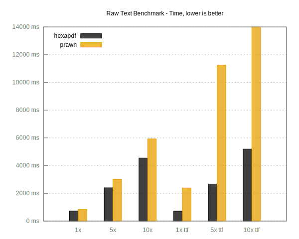
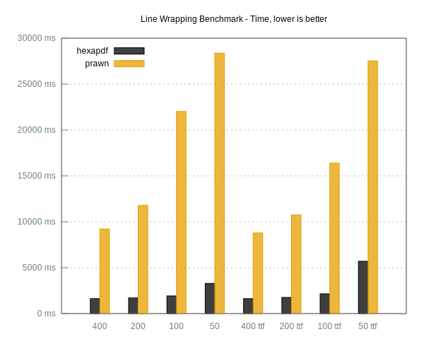
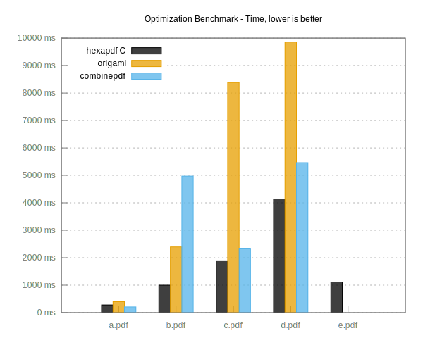

title: State of PDF in Ruby
subtitle: 
author: Thomas Leitner a.k.a. gettalong
theme: league

{:options syntax_highlighter='' /}

## Portable Document Format (PDF)

- Originally developed by Adobe until including version 1.7
- PDF 1.7 also released as ISO 32000-1 in 2008
- PDF 2.0 (ISO 32000-2) released in 2017, updated in 2020
- PDF 2.0 first version to be done by a standards group

## PDF 2.0 Biggest Changes

- Clarifications and corrections of the existing PDF 1.7 spec
- Enhanced encryption
- Better digital signatures
- New annotation types
- Tagged PDF enhancements
- Deprecation of XFA Forms

## PDF Libraries

- For creating
- For reading
- For modifying

## Creating PDFs

- `prawn`
- `wicked_pdf`
- `pdfkit`
- `grover`
- `hexapdf`

## Creating PDFs with Prawn

- Current go-to pure Ruby library
- Still actively developed, although at a slower pace
- Support for OpenType fonts was recently added

## Prawn Extension Gems

- `prawn-templates` (using pages of another PDF as background)
- `prawn-table` (for generating tables)
- `prawn-svg` (using SVG as image format)
- `prawn-icon` (for using icon fonts)
- `prawn-qrcode` (rendering of QRCodes)

## Gems using Prawn

- `invoice_printer`
- `asciidoctor-pdf`
- And various others

## Creating PDFs from HTML

* `wicked_pdf`, `pdfkit`, `grover`
* Use wkhtmltopdf or Puppeteer
* Sometimes easier to design because it's just HTML+CSS
* But not fully in control over every aspect

## Reading PDFs

* `pdf-reader`
  * probably most well known
  * Can't read all PDFs
  * Used by `prawn-templates`

* `origami`
  * More fully-featured
  * No updates in the last two years

- `hexapdf`

## Modifying PDFs

* `combine_pdf`
  - Only for merging, watermarking or stamping
  * Can't handle all PDFs due to missing PDF features

* `origami`
  - AcroForm
  - Digital signatures
  - ... and more

* `hexapdf`

## HexaPDF

<https://hexapdf.gettalong.org>

- Similar to `prawn`
- Similar to `pdf-reader`
- Similar to `combine_pdf`/`origami`
- But also totally different

## HexaPDF Features

- Full-fledged PDF library
- Strives to support most of the PDF specification
- Fast and memory efficient
- Low- and high-level interfaces
- Accompanying command line tool

## HexaPDF Status

- Actively developed since 2014
- 18 releases in the past year
- Fully tested
- AGPL licensed with commercial license available

## HexPDF Compared to Prawn

- Not yet on a par feature-wise
- Different approach to page layouting

## Raw Text Benchmark

{: style="height: 400px; background: white"}

## Line Wrapping Benchmark

{: style="height: 400px; background: white"}

## HexaPDF Compared to combine_pdf/origami

- `combine_pdf`/`origami` not optimized for performance
- Narrow focus of `combine_pdf`, not a full PDF library
- `origami` not actively developed

## Optimization Benchmark

{: style="height: 400px; background: white"}

## `hexapdf` Tool

<pre><code class="nohighlight">
Available commands:
    batch             Execute a single command on multiple files
    files             List or extract embedded files from a PDF file
    form              Show form fields and fill out a form
    help              Provide help for individual commands
    image2pdf         Convert one or more images into a PDF file
    images            List or extract images from a PDF file
    info              Show document information
    inspect           Dig into the internal structure of a PDF file
    merge             Merge multiple PDF files
    modify            Modify a PDF file
    optimize          Optimize the size of a PDF file
    split             Split a PDF file
    version           Show the version of the program
    watermark         Put one or more PDF pages onto another PDF
</code></pre>

## Recent HexaPDF Changes

- Support for interactive forms (AcroForms)
* Flattening of annotations and forms
- Many enhancements for dealing with invalid files
- Next feature release: Digital Signatures

# Thank You!

